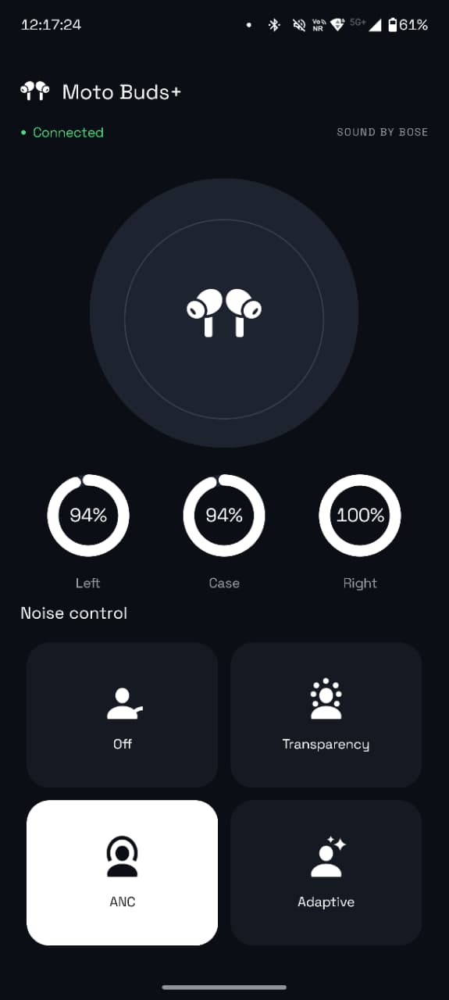

<h1 align="center">🎧 Moto Buds+ ANC 🎧</h1>
<h2 align="center">Minimal Android controller for Moto Buds+ ANC & battery</h2>

<p align="center">
    
</p>

> [!NOTE]
> A lightweight, vibe-coded Android app that talks directly to your **Moto Buds+** over Bluetooth RFCOMM. Toggle ANC modes and check battery levels for the left bud, right bud, and case — no official app needed, no background services running when you close it.

## 🌟 Features

- **ANC Control** – Switch between Off, Transparency, ANC, and Adaptive modes.
- **Battery Monitoring** – View battery percentage for left, right, and case.
- **Live Sync** – Connects and syncs state as soon as you open the app.
- **No Background Drain** – Stops all Bluetooth work when the app is closed or backgrounded.
- **Minimal & Fast** – No feature bloat, just the controls you need.

## 💻 Installation

> Download the latest APK from the [releases page](https://github.com/ArnavK-09/moto-buds-plus-anc-apk/releases) and install it on your Android device.

###### or build from source

```bash
./build.sh
```

## 📷 Screenshots

> Here's the expected look of Moto Buds+ ANC

| Home Screen                |
| -------------------------- |
|  |

---

## 💻 Contributing

> [!TIP]  
> We welcome contributions to improve **Moto Buds+ ANC**! If you have suggestions, bug fixes, or new feature ideas, follow these steps:

1. **Fork the Repository**  
   Click the **Fork** button at the top-right of the repo page.

2. **Clone Your Fork**  
   Clone the repo locally:

   ```bash
   git clone https://github.com/ArnavK-09/moto-buds-plus-anc-apk.git
   ```

3. **Create a Branch**  
   Create a new branch for your changes:

   ```bash
   git checkout -b your-feature-branch
   ```

4. **Make Changes**  
   Implement your changes (bug fixes, features, etc.).

5. **Commit and Push**  
   Commit your changes and push the branch:

   ```bash
   git commit -m "feat(scope): description"
   git push origin your-feature-branch
   ```

6. **Open a Pull Request**  
   Open a PR with a detailed description of your changes.

7. **Collaborate and Merge**  
   The maintainers will review your PR, request changes if needed, and merge it once approved.

## 🙋‍♂️ Issues

Found a bug or need help? Please create an issue on the [GitHub repository](https://github.com/ArnavK-09/moto-buds-plus-anc-apk/issues) with a detailed description.

## 👤 Author

<table>
  <tbody>
    <tr>
        <td align="center" valign="top" width="14.28%"><a href="https://github.com/ArnavK-09"></a><br /><a href="https://github.com/ArnavK-09"><h4><b>Arnav K</b></h3></a></td>
    </tr>
  </tbody>
</table>

---

<h2 align="center">📄 License</h2>

<p align="center">
<strong>Moto Buds+ ANC</strong> is licensed under the <code>Unlicense</code> License. See the <a href="https://github.com/ArnavK-09/moto-buds-plus-anc-apk/blob/main/LICENSE">LICENSE</a> file for more details.
</p>

---

<p align="center">
    <strong>🌟 If you find this project helpful, please give it a star on GitHub! 🌟</strong>
</p>
